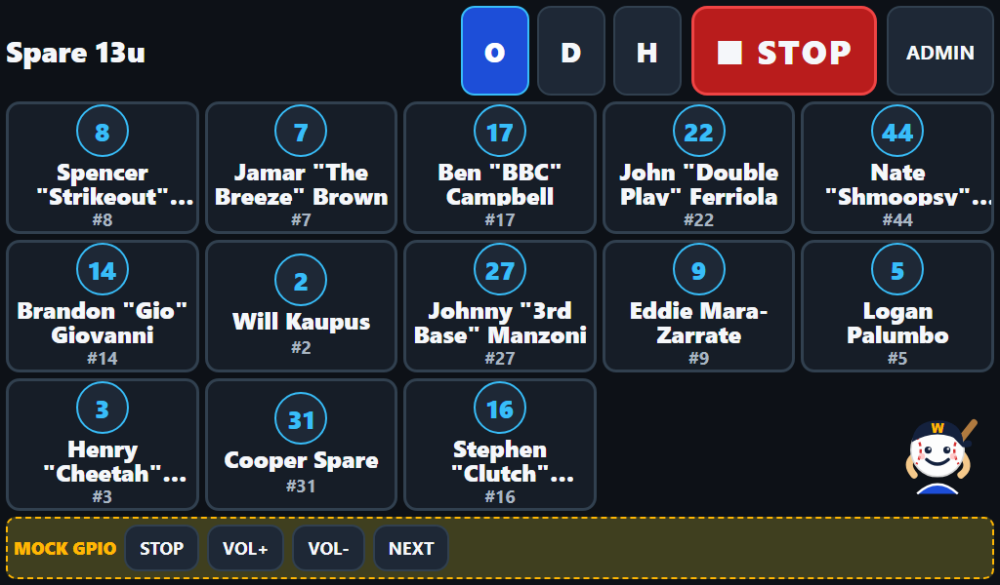
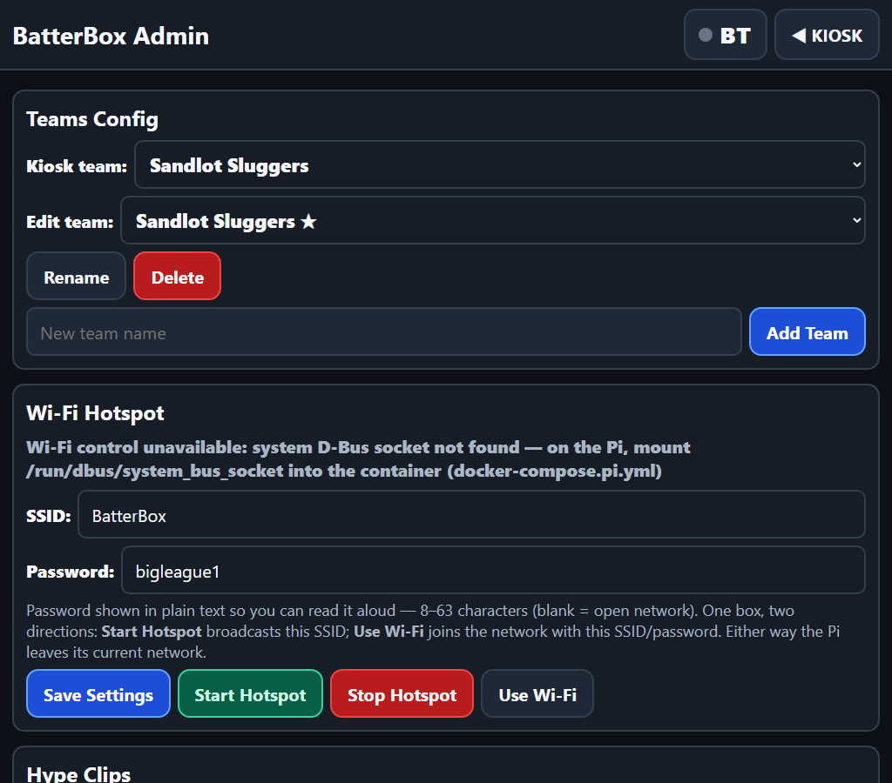
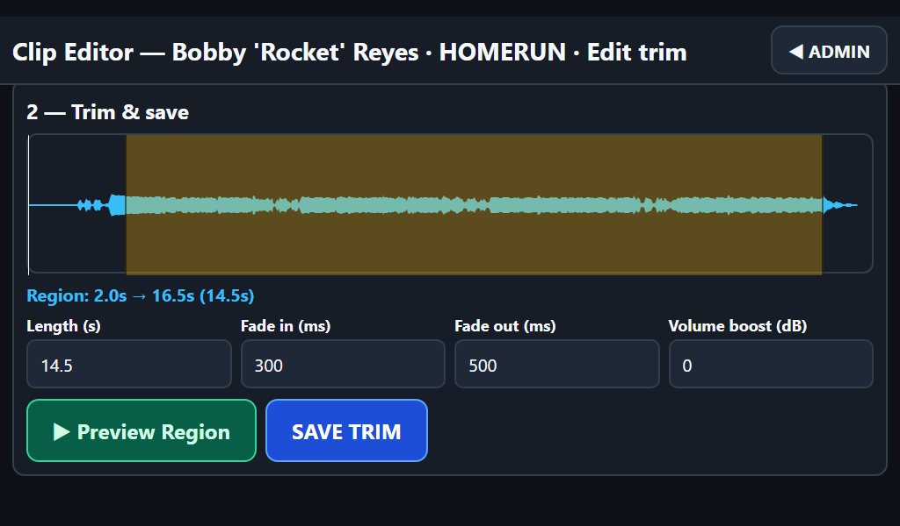
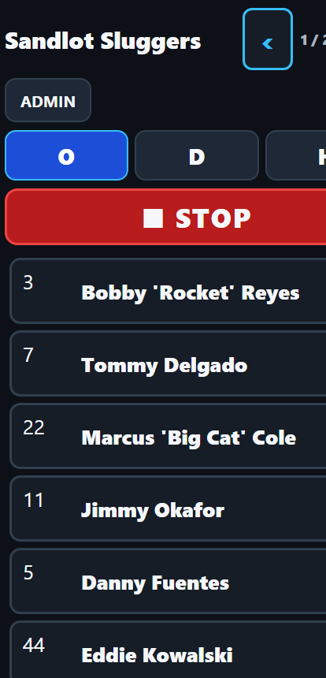

# BatterBox

**Big league music for big league moments.**

BatterBox is a walk-up song player for youth baseball, hosted on a Raspberry Pi in the dugout. Tap a player's face on the touchscreen, their walk-up song blasts over the PA. Long-press for the home-run clip. Walter Walkup — headphones, cap, mustache — is the mascot, and he takes his job seriously.

## What it does

- **Kiosk grid** — 1024×600 touchscreen layout, one big tile per player, photo + name + number. Tap = walk-up clip, long-press (600ms) = home-run clip. Instant switch, STOP in under 200ms.
- **Multiple teams** — switch the active team per game; each team has its own batting order. Touch drag-and-drop reorder in the admin screen.
- **Clip workflow** — import from YouTube or upload mp3/m4a, trim on a waveform editor, add fades and volume boost, loudness-normalized to 192k MP3.
- **Physical buttons** — wire real buttons to the Pi's GPIO pins for STOP / next batter / volume, or use the on-screen/keyboard mock buttons.
- **Works offline at the field** — phones on the dugout Wi-Fi hotspot can queue songs; no internet needed once clips are imported.

## Screenshots

| Kiosk grid (1024×600 touchscreen) | Admin (teams, roster, drag-to-reorder) |
| --- | --- |
|  |  |

| Clip editor (waveform trim) | Phone layout |
| --- | --- |
|  |  |

## Run it on your PC (dev / demo)

Requires Docker Desktop. That's all.

```bash
docker compose up --build
```

Open http://localhost:8080 — the grid loads seeded with two demo teams (Sandlot Sluggers and Dugout Demons). Audio plays through your PC's browser; GPIO is mocked.

Mock GPIO keyboard shortcuts (same code path as real GPIO):

| Key   | Action            |
| ----- | ----------------- |
| Space | Stop              |
| ↑ / ↓ | Volume ±5         |
| N     | Next batter       |

Debug buttons for the same actions appear on screen when mock GPIO is on.

## The clip workflow

Do this at home, on Wi-Fi — YouTube imports need internet, and the field won't have any.

1. Open http://localhost:8080/admin.html — create your team, add players (names + jersey numbers), snap photos or upload them.
2. For each player, paste a YouTube URL (or upload an mp3/m4a) and pick walk-up or home-run.
3. BatterBox downloads the audio in the background and suggests the loudest 30-second window.
4. Open the trim editor: drag the start/end handles on the waveform, preview, set fade in/out and volume boost if a track is quieter than the rest.
5. Save. The clip is sliced, faded, loudness-normalized, and live on the grid.
6. Set the batting order by dragging tiles in admin.

At the field, everything plays from local disk. No internet, no problem.

## Deploy to the Raspberry Pi

Target: Raspberry Pi OS 64-bit (Bookworm or later), Pi 4 or 5 recommended.

1. **Install Docker:**

   ```bash
   curl -fsSL https://get.docker.com | sh
   sudo usermod -aG docker $USER   # log out and back in after this
   ```

2. **Clone and start:**

   ```bash
   git clone <your-repo-url> batterbox
   cd batterbox
   docker compose -f docker-compose.yml -f docker-compose.pi.yml up -d --build
   ```

   The first build takes a while on a Pi — go warm up the infield. The app comes up on port 8080 and restarts on reboot automatically (`unless-stopped`).

3. **Kiosk display** (full-screen touchscreen UI on the Pi's display):

   **No KDE, Gnome, or any desktop environment is needed — and none is used.** The "window system" is one of two tiny options; both just put Chromium's kiosk window on the HDMI touchscreen. There is no Qt app and nothing to write in Qt — Chromium *is* the UI runtime, pointed at `http://localhost:8080`.

   **Option A — Raspberry Pi OS Lite + cage (recommended, lightest).** [cage](https://github.com/cage-kiosk/cage) is a Wayland kiosk compositor: it is the entire "window manager", runs exactly one app full-screen, and is made for appliances like this. Touch works out of the box via libinput.

   ```bash
   sudo apt update && sudo apt install -y cage chromium
   # autologin to a console on boot:
   sudo raspi-config   # System Options → Boot / Auto Login → Console Autologin
   # launch the kiosk when the console session starts:
   echo 'if [ -z "$WAYLAND_DISPLAY" ] && [ "$(tty)" = "/dev/tty1" ]; then exec cage -- /home/pi/batterbox/kiosk/start-kiosk.sh; fi' >> ~/.bash_profile
   ```

   On boot: Pi logs itself in on tty1 → cage starts → `start-kiosk.sh` waits for the container and execs Chromium full-screen. Boot-to-music on a Pi 5 is well under a minute.

   **Option B — Raspberry Pi OS with desktop** (what you'd use anyway for other things): keep the stock Wayland/X session and autostart the kiosk into it:

   ```bash
   mkdir -p ~/.config/autostart
   cp kiosk/batterbox-kiosk.desktop ~/.config/autostart/
   # edit ~/.config/autostart/batterbox-kiosk.desktop if the repo isn't at /home/pi/batterbox
   ```

   Either way the kiosk script waits for the app to answer on port 8080, then opens Chromium full-screen. Audio plays through the browser out the 3.5mm jack / HDMI / USB DAC — plug your speaker/PA into the Pi.

4. **Networking at the field** — two ways to get phones and the Pi on the same network:

   **Option A — Pi joins your iPhone's hotspot (recommended; the Pi gets internet too).** Turn on the iPhone's Personal Hotspot (Settings → Personal Hotspot; also enable *Maximize Compatibility* — that keeps it on 2.4GHz, which the Pi's Wi-Fi prefers). Then, once, on the Pi:

   ```bash
   sudo nmcli device wifi connect "Your iPhone Name" password "your-hotspot-password"
   ```

   The Pi remembers the network and rejoins automatically. Side effect: the Pi has real internet through the phone — YouTube imports and the yt-dlp auto-update keep working at the field.

   **Option B — Pi runs its own hotspot (fully offline).** No internet anywhere; good when there's no cell signal — or when the phone plan charges for tethering. Everything is done from the admin UI: open Admin → **Wi-Fi Hotspot**, set the SSID and password (defaults: `BatterBox` / `bigleague1`), and tap **Start Hotspot**. The Pi leaves its current Wi-Fi and broadcasts the new network — join it from your phone and reopen http://batterbox.local (or http://10.42.0.1). **Stop Hotspot** turns it off; the Pi rejoins any remembered network on its own. You can also save the SSID/password ahead of time with **Save Settings** (works on the PC at home, where there's no Wi-Fi radio to control).

   Fallback if the admin UI can't reach the Pi at all, run once on the Pi itself:

   ```bash
   sudo nmcli device wifi hotspot ifname wlan0 con-name batterbox ssid BatterBox password "bigleague1" band bg
   ```

5. **Find the Pi by name, not IP (mDNS/Bonjour).** Raspberry Pi OS ships with Avahi, which broadcasts the Pi's hostname as `<hostname>.local` — no app-side work needed. Set the hostname once:

   ```bash
   sudo hostnamectl set-hostname batterbox   # then reboot
   ```

   With the Pi compose override the app answers on port 80, so from any phone on the same network:

   ```
   http://batterbox.local
   ```

   That's it — no port, no IP. (iPhone, Android, Mac, and Windows all resolve `.local`; a bare `http://batterbox` often works too, but `.local` is the guaranteed form. Bookmark it on the dugout phones.) Optional: `sudo cp kiosk/avahi/batterbox.service /etc/avahi/services/` to make BatterBox show up in Bonjour service browsers as well.

   If a phone can't resolve the name, fall back to the Pi's IP: `ip addr show wlan0` on the Pi (typically `http://10.42.0.1` in option B). The grid and admin pages work fine on a phone screen.

### Audio: browser vs server backend

Default is `AUDIO_BACKEND=browser`: the kiosk Chromium on the Pi plays the sound. Zero Docker audio config needed.

If you want the Pi headless (no browser, phones only), set `AUDIO_BACKEND=server` in `docker-compose.pi.yml` — mpv inside the container plays directly to ALSA via the mapped `/dev/snd`. You may need `AUDIO_OUTPUT` (e.g. `plughw:1,0` for a USB dongle) if auto picks the wrong device.

### Bluetooth speaker

The kiosk Chromium plays audio to the Pi's OS default output — so a Bluetooth speaker just needs to be paired to the Pi itself.

**Primary flow (speaker/phone initiates):** tap the **BT** button on the kiosk top bar. It starts flashing blue — the Pi is discoverable for 120 seconds (tap again to stop early). During that window, select the Pi (its hostname, e.g. `raspberrypi`) from the speaker's or phone's Bluetooth menu. When a device is connected the dot turns solid blue and the button tooltip shows its name. Pairing auto-accepts — no PIN.

**Some speakers can't browse for devices** (they expect to be discovered). For those, pair once from the Pi OS desktop (or `bluetoothctl scan on` → `pair <MAC>` on the host), then reconnect later with `POST /api/bluetooth/connect` and the speaker's MAC.

On PC dev there's no BlueZ in the container by design — the BT button shows "Bluetooth unavailable" instead of breaking anything.

An optional physical LED mirrors the flashing state: wire an LED (with ~330Ω resistor) to GPIO 26 (BCM) — it blinks ~2Hz while pairing is active. Disable by setting `gpio_bt_led_pin` to `0`.

`docker-compose.pi.yml` already mounts the host's BlueZ D-Bus socket; the Pi's stock bluetooth service does the rest.

## Configuration

All env vars, settable in `docker-compose.yml` / `.env` / shell:

| Var             | Default   | What it does                                                            |
| --------------- | --------- | ----------------------------------------------------------------------- |
| `PORT`          | `8080`    | HTTP port                                                               |
| `DATA_DIR`      | `/data`   | SQLite DB + clips/photos/sources (mounted to `./data` on the host)      |
| `MOCK_GPIO`     | `true`    | `true` = keyboard/on-screen mock buttons; `false` = real GPIO (Pi)      |
| `AUDIO_BACKEND` | `browser` | `browser` = clients play audio; `server` = mpv in-container to ALSA     |
| `AUDIO_OUTPUT`  | `auto`    | ALSA device hint for server playback (e.g. `plughw:1,0`)                |
| `YTDLP_AUTO_UPDATE` | `true` | `true` = upgrade yt-dlp to latest at container start when online        |

Playback settings (default snippet length, master volume) are also editable live in admin.

## GPIO wiring

Physical buttons call the same playback API as the touchscreen — one code path, no surprises. Wire momentary push buttons between GPIO pins and GND (uses internal pull-ups, active-low). Suggested defaults, BCM numbering:

| Button      | BCM pin  | Physical pin |
| ----------- | -------- | ------------ |
| Stop        | GPIO 17  | 11           |
| Next batter | GPIO 27  | 13           |
| Volume up   | GPIO 22  | 15           |
| Volume down | GPIO 23  | 16           |
| BT pairing LED (optional, via ~330Ω resistor) | GPIO 26 | 37 |

`/dev/gpiomem` is mapped into the container by `docker-compose.pi.yml` — no privileged container needed. Keep wires away from the audio cable; GPIO noise on a cheap speaker wire sounds like a swarm of bees.

## Troubleshooting

- **"No audio output device found" warning** — the app couldn't find a sound device. With `browser` backend this is just informational (browsers play their own audio); with `server` backend, check that `/dev/snd` is mapped (Pi compose file), the speaker is plugged in before container start, and try setting `AUDIO_OUTPUT` explicitly (`aplay -l` on the Pi lists devices).
- **YouTube imports fail** — YouTube changes its internals regularly; yt-dlp answers with frequent releases. Two layers of defense:
  1. **At every container start with internet access, BatterBox auto-upgrades yt-dlp to the latest release** (check `docker compose logs app` for the `[entrypoint] yt-dlp` line). Offline (the field), it silently keeps the baked-in version. Disable with `YTDLP_AUTO_UPDATE=false`.
  2. The pin in `requirements.txt` is the known-good fallback baked into the image — what you tested at home is what runs at the field. If imports break even after the auto-update, bump the pin and rebuild:

  ```bash
  pip index versions yt-dlp          # or check https://github.com/yt-dlp/yt-dlp/releases
  # edit requirements.txt, then:
  docker compose up --build
  ```

- **Nothing downloads at the field** — expected. YouTube import needs internet. Import at home; the field run is fully offline.
- **Chromium shows a "restore pages?" bubble** — the kiosk script already passes `--disable-session-crashed-bubble` and `--incognito`; if you see it anyway you killed power mid-write. It's harmless; tap through once.
- **Container logs** — `docker compose logs -f app`.

## Repo layout

- `app/` — FastAPI backend (routers, clip pipeline, playback, GPIO)
- `static/` — no-build JS SPA (kiosk grid, admin, trim editor, Walter Walkup)
- `data/` — runtime data (gitignored)
- `docs/API.md` — binding backend↔frontend API contract
- `kiosk/` — Pi kiosk launcher + autostart desktop entry
